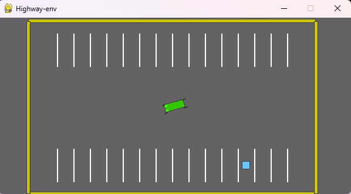

Sort of reinforcement learning algorithm implementations
write in single py script in order to readable

FYI: all(models can work) = False, which will be commended in top of script

Trained model DEMO:

Parking: Agent aim to park to the target position

FlappyBird: Avoid crush

